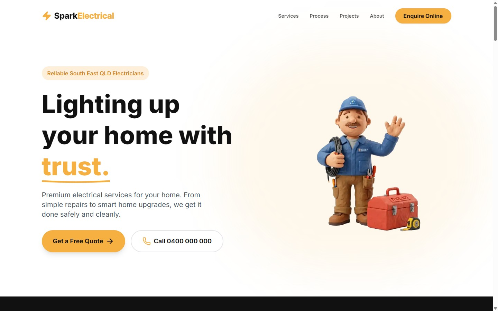

# Spark Electrical — Domestic Electrician Website

A modern, high-conversion marketing site for a residential electrical contractor, built as a front-end portfolio piece. It pairs a polished, animated UI with real interactive tooling (a live energy-savings calculator, before/after galleries and an intent-aware contact form) and is engineered for performance and accessibility.

**Live demo:** https://vasari-studio.github.io/domestic-electrician-website/



> ⚠️ **Demo notice.** *Spark Electrical* is a fictional business created for this portfolio. Contact details, licence numbers, reviews and imagery are illustrative only.

---

## Tech stack

| Tool | Purpose |
| :--- | :--- |
| **React 19** + **TypeScript** | Component UI with end-to-end type safety |
| **Vite 8** | Dev server and production bundling |
| **Tailwind CSS v4** | Utility-first styling with a small custom theme |
| **Framer Motion** | Scroll reveals and micro-interactions |
| **React Router 7** | Client-side routing for a multi-page SPA |
| **Lenis** | Lightweight smooth scrolling |
| **Lucide React** | Icon set |

---

## Features

- **Animated hero** — an optimised animated WebP illustration with a clean value proposition and dual call-to-actions.
- **Service catalogue** — nine services, each with its own SEO-friendly detail page generated from a typed data source.
- **Case studies** — project pages with rich, interactive widgets:
  - a **live LED savings calculator** (drag to estimate annual kWh and dollar savings);
  - a **before/after** layout for the emergency repair story;
  - a **thumbnail gallery** with active-image swapping.
- **Intent-aware contact form** — selecting *Emergency / Urgent Call-out* animates a high-priority "Call Now" button into view.
- **Stylised service-area map** — a bespoke, animated coverage graphic (no third-party map embed, so nothing to load or track).
- **Process, trust bar and reviews** — supporting sections with consistent, staggered scroll reveals.

## Design system

Defined once as CSS custom properties in [`src/index.css`](src/index.css) and consumed through Tailwind tokens:

- **Primary (amber):** `#F5B041` — CTAs, highlights, the lightning-bolt logo
- **Dark (charcoal):** `#111111` — hero contrast, footer, dark sections
- **Light:** `#FAFAFA` — airy section backgrounds
- **Type:** [Inter](https://rsms.me/inter/) (400–800), preconnected and loaded with `font-display: swap`

Motion is centralised in [`src/lib/motion.ts`](src/lib/motion.ts) (`revealUp`, `enterUp`) so every reveal shares one distance, duration and easing curve.

## Performance & accessibility

- **Optimised hero** — the animated WebP was re-encoded and resized (~4.9 MB → ~1.5 MB) and preloaded as the LCP element.
- **Route-based code splitting** — secondary routes are lazily loaded so the landing page ships less JavaScript.
- **Lazy, dimensioned images** — off-screen imagery uses `loading="lazy"`; the hero declares intrinsic size to avoid layout shift.
- **`prefers-reduced-motion`** — smooth scroll, looping animations and transitions are disabled for users who opt out.
- **Accessible forms & nav** — labelled inputs with autocomplete hints, and an `aria-expanded` / `aria-controls` mobile menu toggle.
- **Base-path-safe assets** — all `public/` references resolve through [`src/lib/asset.ts`](src/lib/asset.ts), so they work at the domain root *and* under a project sub-path.

---

## Project structure

```text
src/
├── components/          # Home-page sections & shared UI
│   ├── Navbar.tsx        Footer.tsx        Hero.tsx
│   ├── TrustBar.tsx      Services.tsx      Process.tsx
│   ├── Projects.tsx      Reviews.tsx       About.tsx
│   ├── Contact.tsx       EmergencyBanner.tsx
├── pages/
│   ├── Home.tsx          # Landing page (assembles the sections)
│   ├── ServiceDetail.tsx # Dynamic /services/:id
│   ├── ProjectDetail.tsx # Dynamic /projects/:id
│   ├── ContactPage.tsx   PrivacyPage.tsx   TermsPage.tsx
│   ├── NotFoundPage.tsx  Layout.tsx        # Shell + scroll restoration
├── data/
│   ├── services.tsx      # Typed service definitions
│   └── projects.ts       # Typed case-study definitions
├── lib/
│   ├── asset.ts          # Base-URL-aware public asset resolver
│   ├── motion.ts         # Shared Framer Motion presets
│   └── ledSavings.ts     # LED energy/cost savings model
├── App.tsx               # Router + lazy routes + smooth scroll
└── main.tsx              # Entry point
```

---

## Getting started

Requires Node 18+.

```bash
# Install dependencies
npm install

# Start the dev server (http://localhost:5173)
npm run dev

# Type-check and build for production
npm run build

# Preview the production build locally
npm run preview

# Lint
npm run lint
```

---

## Deployment (GitHub Pages)

The project is pre-configured to deploy to a GitHub Pages **project site**.

1. **Base path** — [`vite.config.ts`](vite.config.ts) sets `base` to `/domestic-electrician-website/` for production builds and `/` for local dev. React Router's `basename` and the `asset()` helper both read this automatically, so no paths are hard-coded.
2. **SPA fallback** — a small Vite plugin copies `dist/index.html` to `dist/404.html` on build, so deep links like `/services/led-light-conversions` resolve correctly on a static host.
3. **Publish:**
   ```bash
   npm run deploy   # builds, then pushes dist/ to the gh-pages branch
   ```
   Then set **Settings → Pages → Source** to the `gh-pages` branch.

---

## Credit

Designed & built by **[Dylan Coleman](https://dylan-coleman.com)**.
